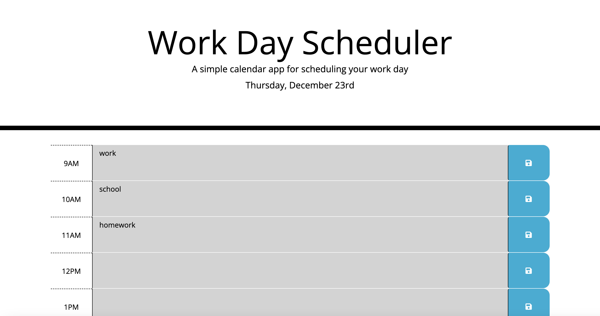

# day-planner

The day planner is an application that allowst the user to enter events in 
timeblocks and will be saved, the timeblocks range from 9 AM to 5 PM.
HTML, CSS and jQuery are used in this application. As long as the user clicks the save
button to the right of the time blocks, the event will be saved to local storage so that 
if the user refereshes the app, their information will still be there.

The green color in a time block represents the current time block. The red time blocks represent
the timeblocks that haven't happened yet, and the grey time blocks have alreay happened.

